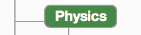
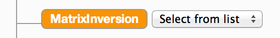
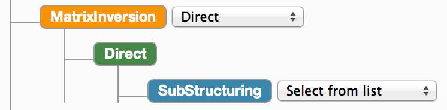
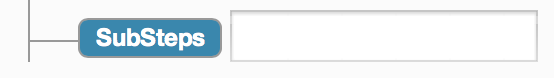
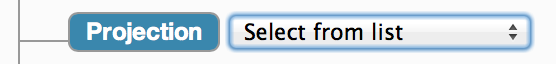
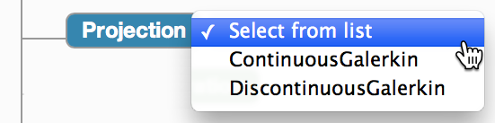

# Building TemPSS Templates

###### Note: This document relates to the _new XML model_ for creating templates in TemPSS, not the [original XML Schema model](CreatingTemplates.md) for creating templates.

## Overview

TemPSS templates are tree-style structures that represent all the possible parameters for a Nektar++ solver, structured according to how they are semantically related.

A TemPSS template is specified by a developer or domain expert user in XML format and is then processed and displayed to users as an HTML tree within the TemPSS web application. Templates were originally specified using an XML Schema format but this was considered to be overly complex and verbose so a new XML format is available. This is the format described in this document. The legacy XML Schema format is still used behind the scenes and old schema-based template definitions will still work correctly within TemPSS.

## Template XML Format Reference

##### Template structure

The XML template definition format has no specific structural requirements beyond that of being a valid XML document. The template definition is a free-form XML structure that can accept tags of any name defining the names of nodes in a template tree. There are, however, some pre-defined tags that may be used to specify key information such as documentation and constraints. These are detailed in the sections below.

##### Parameter naming

We follow the convention of using "[upper camel case](https://en.wikipedia.org/wiki/Camel_case)" (camel case with an intial capital letter, e.g. MyNodeName) for template parameter names and advise the use of this approach when designing templates. 

##### XML declaration

Always begin you template definition with the XML v1.0 declaration:

```<?xml version="1.0" encoding="UTF-8"?>```

##### Root tag

The root tag should be based on the solver name and will be rendered as the base template tree node from which all other nodes inherit. For example, in the case of the Nektar++ Cardiac Electrophysiology solver, the root node may be named:

`<CardiacElectrophysiology>`

###### Namespace

You are recommended to set the detault namespace for your schema document to *http://www.libhpc.imperial.ac.uk* by adding the namespace attribute `xmlns="http://www.libhpc.imperial.ac.uk"` to your root node. As detailed later in this document, some additional TemPSS XML tags that may be of use to you come from the libhpc and tempss namespaces which can be imported using the following attributes respectively: 

```
xmlns:libhpc="http://www.libhpc.imperial.ac.uk/SchemaAnnotation"
xmlns:tempss="http://www.libhpc.imperial.ac.uk/tempss/SchemaAnnotation"
```

##### Node types

In addition to the root node, there are three different types of nodes that may be rendered in a template tree:

1. _Group node_: A group node is rendered in green and is a parent node for one or more _group_, _choice_ or _input_ nodes. A group node can be clicked to display or hide its descendents.
2. _Choice node_: A choice node is rendered in orange and includes a drop down select box containing a set of value choices for the parameter in question. Selecting one of these choices will open a new branch containing additional nodes to be completed.
3. _Input node_: An input node is rendered in blue and may contain a standard input box for keyboard input or a dropdown list containing a set of valid choices for the parameter.

_In some cases, giving a node the name you want may be impractical due to XML element naming constraints. As such, any one of the above node types that you write in a template XML description may be given a `name` attribute that will be used in preference to the element name wwhere possible._

###### Group nodes

A group node can be specified simply by adding an XML tag into the XML template definition. By then adding child nodes to this tag, you are denoting this as a group node. All child nodes will be displayed when the group node is clicked. So, for example, to specify a group node representing _Physics_ properties of a problem that consist of _Model_ and _CellModel_ details, you might add something similar to the following to your XML:

```xml
<Physics>
    <Model ... > ... </Model>
    <CellModel ... > ... </CellModel>
</Physics>
```

This would be rendered as shown:



_Note: You can optionally add the `nodeType` attribute with a value of `group` to a group node to aid readability of your template definition._
 
###### Choice nodes

A choice node is denoted by adding the attribute `nodeType` with a value of `choice`. If a node is set as a choice node, instead of being a clickable tree node that opens up to display all the child nodes when clicked, the node is rendered with a dropdown selection box displaying the names of all the child elements. When a selection is made, the node opens up to reveal the selected branch and its nodes.

A choice node may be specified as follows:

```xml
<MatrixInversion nodeType="choice"> ... </MatrixInversion>
```

This node would be rendered like this:



Choices within a choice node list are formed from its top level descendents, e.g.:

```xml
<MatrixInversion nodeType="choice">
  <Direct>
    ...
  </Direct>
  <Iterative>
    ...
  </Iterative>
</MatrixInversion>
```
The above structure, with the `Direct` option selected would render like this:



###### Input nodes

Input nodes can take the form of either a dropdown list containing possible options for a value, or a text input box where a value can be entered by the user. The `inputType` attribute should be set to either `choice`, `text` or `file` to determine the type of input node. Validation information can be added to `text` input nodes and `file` input nodes so that the user interface can validate the value entered by a user and provide feedback on whether the user has entered a correct value or not. More information on validation is provided in the _[Additional elements](#additional-elements)_ section. 

To specify a text input node, you would write something similar to the following:

```xml
<SubSteps inputType="text"></SubSteps>
```

This would be rendered in the template tree as a text input node:



To specify a choice input node, you would write XML similar to the following:

```xml
<Projection type="xs:string" inputType="choice">
  <tempss:item>ContinuousGalerkin</tempss:item>
  <tempss:item>DiscontinuousGalerkin</tempss:item>
</Projection>
```

This will result in the node being rendered as shown:



When the select box is clicked, the options will be shown for the user to make a selection:



#### Data types

Input or choice nodes must have their data type specified. Data types are specified using the `type` attribute, e.g.

```xml
<Conductivity type="xs:double"/>
```

Standard XML types such as `string`, `double`, `float` and `integer` are supported. See the [XML Datatypes documentation](http://www.w3.org/TR/xmlschema-2/) for more information.

In addition to the standard XML types, TemPSS defines some additional types that extend the built-in standard types and can be specified in template definitions. These types are defined in `NektarTypes.xsd` which is automatically imported by the converter that reads your XML template description and converts it into an XML Schema-based format that TemPSS uses to generate the HTML tree that you see displayed in the TemPSS web interface. The additional types are in the *http://www.libhpc.imperial.ac.uk* namespace. If you have set up the default namespace in your XML template definition document as described in the Root tag->Namespace section at the start of this document then you can use these additional types without any prefix. If, however, you have set up another namespace for your template, you will need to set up a prefix for the *http://www.libhpc.imperial.ac.uk* namespace and use this on each of the instances of the following types.

*__positiveDouble__*: A double value that is > 0

*__positiveIncDouble__*: A double value that is >= 0

*__positiveIncDouble01__*: A double value *x* where 0 >= *x* <= 1

*__OnOffType__*: A complex type providing a drop down selection of two options *On* or *Off*

*__NektarBooleanType__*: A complex type providing a drop down selection of two options *True* or *False*

*__fileName__*: A complex type providing a file browse button to enable selection of a local file.

*__fileNameString__*: A complex type providing a text box with file browse button to enable selection of a local file. This selects only the file name, not the content. 

*__geometryFileName__* and *__BoundaryDetails__*: These are special types that are detailed in the "*Handling input geometries and boundary conditions*" section below.

#### Additional elements

In addition to the flexible, free-form nature of the element structure for specifying template parameter nodes, there are some pre-defined elements that can be used to define additional template properties. These elements include the ability to specify _parameter documentation_ and _validation details_, and an element to link in a separate _parameter constraint_.

These additional elements belong to the TemPSS _Template Annotations_ schema. This can be imported as the _tempss_ namespace by adding the following attributes to the root node of your XML template definition:

```
xmlns:tempss="http://www.libhpc.imperial.ac.uk/tempss/TemplateAnnotations"
xmlns:xsi="http://www.w3.org/2001/XMLSchema-instance"
xsi:schemaLocation="http://www.libhpc.imperial.ac.uk/tempss/TemplateAnnotations TemPSSTemplateAnnotations.xsd"
```

The different elements defined in the TemPSS Template Annotation schema and their functionality will now be described.

###### Documentation

Details of how to add documentation to nodes.

###### Validation and Units

Details of how to add validation information and details of parameter value units.

###### Constraints

Constraints are specified using a separate constraint file. See the [_Specifying constraints_](#specifying-constraints) section for details on how to write this file. A `constraintFile` tag is provided in the Template Annotation schema to link the constraint file with the template. The constraintFile tag must be placed as a direct descendent of the root tag. A constraint file is linked as follows:

```
<CardiacElectrophysiology>
  <tempss:constraintFile file="./NektarCardiacElectrphysiologyConstraints.xml"/>
  ...
</CardiacElectrophysiology>
```

## Template conversion

Information about how template conversion is carried out.

## Specifying constraints

Constraints between parameters in a template tree are specified in a separate file. In this section we describe the XML constraint file format and explain how to define constraints between parameters. 
