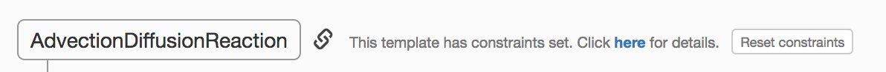
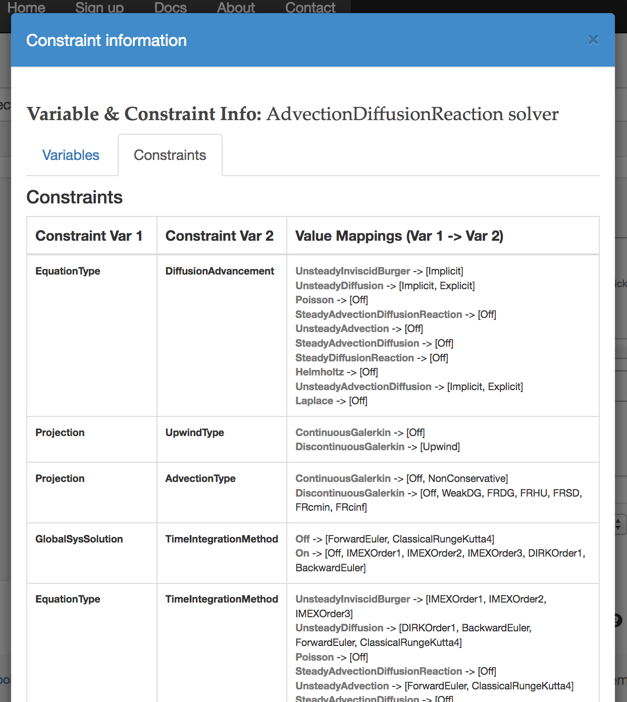
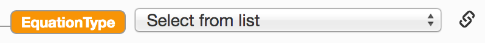
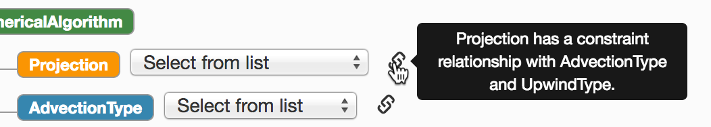
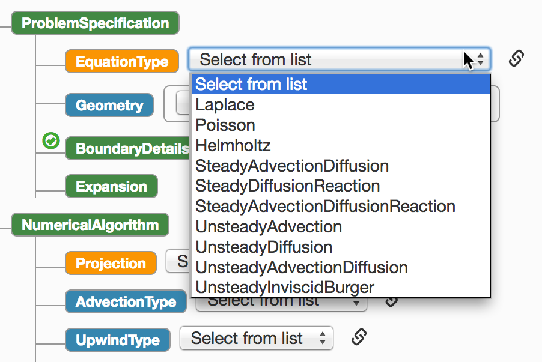
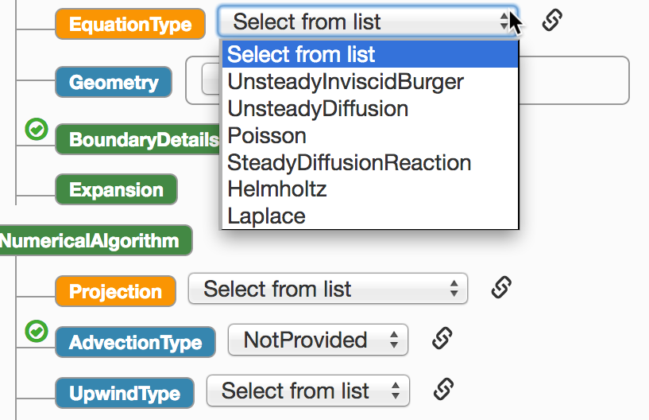
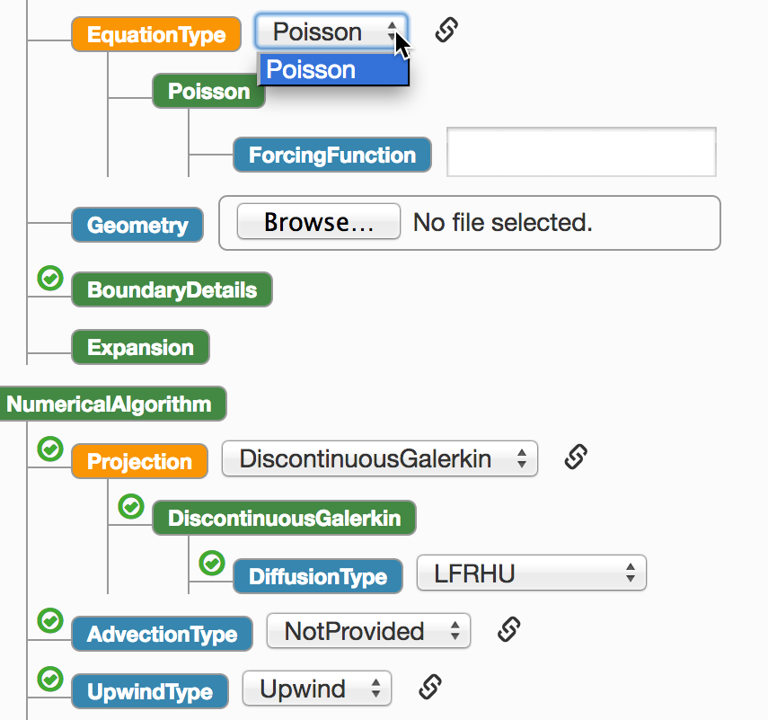
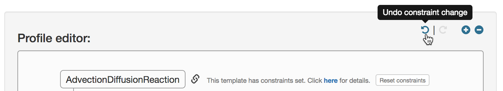

# Working with Constraints in TemPSS Templates

The "Defining Constraints for TemPSS Templates" document describes the process of specifying constraints for a TemPSS template. This document provides information on working with these constraints from a user perspective within the TemPSS web-based interface.

When a template is loaded in TemPSS, if it has constraints defined, these will be processed and a link symbol and text will be shown alongside the root node in the profile editor:

## Constraint Details

An overview of the constraints defined for a solver template can be accessed by clicking the details link alongside the template root node (as shown in the above figure). When the link is clicked a pop-up box appears showing the details:

The variables tab in the above figure shows all the variables for the current solver that have constraints defined. Selecting the constraints tab displays pairs of constrained variables along with an overview of their value mappings. The figure below shows part of a constraint mapping information table:

## Making Variable Selections

You can identify variables in a TemPSS template tree that have constraints attached by the link symbol that is displayed alongside them, e.g.:

If you place the mouse pointer over the constraint symbol, an overlay will be displayed specifying other variables that the selected variable has constraint relationships with, e.g.:

When selection of a variable value is made from a list of possible choices, the constraint solver is called with the values of all currently set variables that have constraints. The solver identifies the possible values of all these variables given the selection that has been made and the state of all the variables is sent back to the TemPSS user interface.

Taking the AdvectionDiffusionReaction solver as an example, when the template is first opened, the EquationType variable has its full domain of values available as possible options:

There is a constraint between `EquationType` and `AdvectionType`. If an equation type is being used that has no advection term, it is invalid to specify an advection type and this must be set to `NotProvided`.

To demonstrate how TemPSS handles this, we set the `AdvectionType` value to `NotProvided`. The solver is then called and identifies that equation type values that have an advection term should be removed. The state of the list of `EquationType` values after making this change is shown below:

Here we can see that all the `EquationType` options that had an advection term have been removed. When there is more than one choice available for a variable with constraints, the interface shows a drop-down list with "Select from list" as the default option. When there is only a single possible value, only that value is shown. This is demosntrated below where we have chosen the `Poisson` equation type and that becomes the only available option in the list.

## Reverting and Resetting Constraint Changes

#### Undo/Redo Functionality

If you make a selection in the TemPSS tree for a value that has constraints, the tree is updated and some previously available options may disappear to reflect the restricted set of available choices given the change that you have made. 

Sometimes you may want to return to a previous state in order to make an alternative selection. This is especially important when building a configuration and testing or investigating the effects of selecting certain parameters on your configuration.

TemPSS provides undo and redo functionality via the buttons that appear in the profile editor's header bar:

These icons are not shown for templates that do not have any constraints configured.

You can undo changes right back to the initial state where all constrained variables are unselected. If you want to reapply one or more states that you have undone, you can use the redo functionality to acheive this. Note that the undo and redo icons will be disabled if it is not possible to undo or redo in the current state.

#### Resetting constraint values

As an alternative to undoing changes you can reset all values to their original state by clicking the _Reset constraints_ button. This will display a warning to confirm that you are happy to apply this change since resetting constraints will also remove all undo/redo state.
